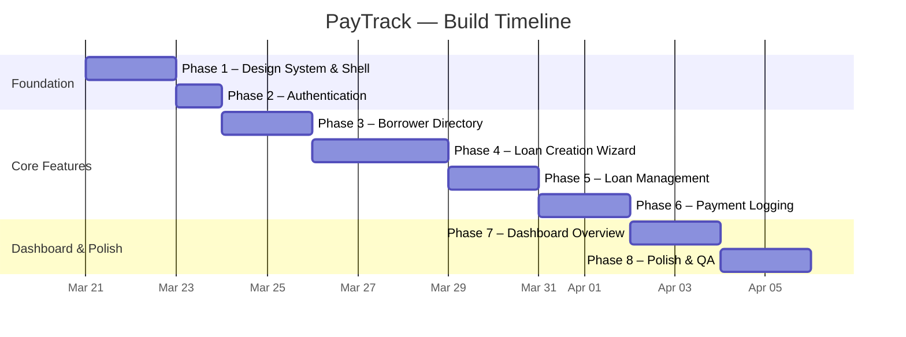
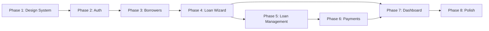

# PayTrack — Development Roadmap

> A phased timeline to go from the current scaffold to a fully functional V1.

---

## Current Progress ✅

| Area                                                    | Status               |
| ------------------------------------------------------- | -------------------- |
| Next.js 16 + Tailwind v4 scaffold                       | ✅ Done              |
| Supabase client/server/middleware                       | ✅ Done              |
| Database schema (borrowers, loans, schedules, payments) | ✅ Migrated with RLS |
| Loan math engine (`loanMath.ts`)                        | ✅ Done              |
| Phase 1: Design System & Layout Shell                   | ✅ Done              |
| Phase 2: Authentication                                 | ✅ Done              |
| Phase 3: Borrower Directory                             | ✅ Done              |
| Phase 4: Loan Creation Wizard                           | ✅ Done              |
| Phase 5: Loan Management                                | ✅ Done              |
| Phase 6: Payment Logging                                | ✅ Done              |
| Phase 7: Dashboard Overview                             | ✅ Done              |
| Phase 8: Polish & QA                                    | 🚧 In Progress       |

---

## Phase 1 — Design System & Layout Shell

**Goal:** Establish the global visual foundation described in [UI_ARCHITECTURE_DESIGN.md](file:///c:/Users/alec/Desktop/Projects/paytrack/docs/UI_ARCHITECTURE_DESIGN.md) and the app-wide navigation shell.

| #   | Task                       | Details                                                                                                                                                      |
| --- | -------------------------- | ------------------------------------------------------------------------------------------------------------------------------------------------------------ |
| 1.1 | **Global CSS & Theme**     | Implement the Gilded-Ivory / Metallic-Gold color palette, Inter font, tabular-nums, and the `gold-glow` animation in `globals.css` via Tailwind v4 `@theme`. |
| 1.2 | **Root Layout**            | Sidebar / top-nav shell with navigation links: _Dashboard_, _Borrowers_, _Loans_, _Payments_. Responsive sidebar collapse for mobile.                        |
| 1.3 | **Reusable UI Primitives** | Build shared components: `Button`, `Card`, `Input`, `Select`, `Modal`, `Badge` (status tags), `DataTable` skeleton — all following the design system tokens. |

> **Estimated effort:** ~1–2 sessions

---

## Phase 2 — Authentication

**Goal:** Gate the app behind Supabase Auth so every record is scoped to `auth.uid()`.

| #   | Task                      | Details                                                                                                       |
| --- | ------------------------- | ------------------------------------------------------------------------------------------------------------- |
| 2.1 | **Login / Sign-up Pages** | Email + password auth using Supabase Auth UI or custom forms. Styled to match the gold/ivory theme.           |
| 2.2 | **Auth Middleware**       | Already wired — verify it redirects unauthenticated users to `/login` and protects all `/dashboard/*` routes. |
| 2.3 | **Session Context**       | Provide a `useUser()` hook or server-side helper to access the current user's `id` for all data-fetching.     |

> **Estimated effort:** ~1 session

---

## Phase 3 — Borrower Directory

**Goal:** Full CRUD for borrowers — the first real data feature.

| #   | Task                                         | Details                                                                                              |
| --- | -------------------------------------------- | ---------------------------------------------------------------------------------------------------- |
| 3.1 | **Borrowers List Page** (`/borrowers`)       | Searchable, filterable table showing Name, Contact, Active Loans count, Status (Active/Paid badge).  |
| 3.2 | **Add Borrower Flow**                        | Modal or inline form: First Name, Last Name, Email, Phone. Server Action → `borrowers` table insert. |
| 3.3 | **Borrower Detail Page** (`/borrowers/[id]`) | Profile card + tabbed view of their loans and payment history. Edit & delete capabilities.           |

> **Estimated effort:** ~1–2 sessions

---

## Phase 4 — Loan Creation Wizard _(The Engine)_

**Goal:** Implement the two-track loan creation flow described in [BUSINESS_LOGIC.md](file:///c:/Users/alec/Desktop/Projects/paytrack/docs/BUSINESS_LOGIC.md).

| #   | Task                         | Details                                                                                                                             |
| --- | ---------------------------- | ----------------------------------------------------------------------------------------------------------------------------------- |
| 4.1 | **Wizard UI** (`/loans/new`) | Multi-step form: (1) Select Borrower → (2) Enter Principal & Release Date → (3) Review Schedule & Allocations → (4) Confirm & Save. |
| 4.2 | **Small Loan Path (≤ 5k)**   | Connect `loanMath.ts` small-loan engine. Show term-type selector (Weekly / 1-Month / 15th-30th). Auto-generate schedule preview.    |
| 4.3 | **Big Loan Path (> 5k)**     | Connect `loanMath.ts` big-loan engine. Custom months input. Declining-interest amortization table preview.                          |
| 4.4 | **RC / EDITH Allocation**    | Auto-fill 80/20 split of total interest. Editable override inputs with validation (sum must equal total interest).                  |
| 4.5 | **Save to Supabase**         | Server Action: insert into `loans` + bulk-insert into `schedules`. Cents → dollars conversion at the boundary.                      |

> **Estimated effort:** ~2–3 sessions

---

## Phase 5 — Loan Management

**Goal:** View, manage, and track individual loans.

| #   | Task                                 | Details                                                                                                                   |
| --- | ------------------------------------ | ------------------------------------------------------------------------------------------------------------------------- |
| 5.1 | **Loans List Page** (`/loans`)       | Table with columns: Borrower, Principal, Category, Status, Release Date, Remaining Balance. Filters by status & category. |
| 5.2 | **Loan Detail Page** (`/loans/[id]`) | Full loan card + payment schedule table (expected dates & amounts). Live remaining-balance calculation. Status badge.     |
| 5.3 | **Mark Loan as Paid**                | Action button to flip status to "Paid" when balance reaches zero (or manual override).                                    |

> **Estimated effort:** ~1–2 sessions

---

## Phase 6 — Payment Logging

**Goal:** One-click payment recording as described in the PRD.

| #   | Task                      | Details                                                                                                                                                                                    |
| --- | ------------------------- | ------------------------------------------------------------------------------------------------------------------------------------------------------------------------------------------ |
| 6.1 | **Payment Modal**         | Accessible from the Loan Detail page or a global "Log Payment" button. Fields: Borrower/Loan selector, Amount, Date, Method, Notes. Follows the modal spec in `UI_ARCHITECTURE_DESIGN.md`. |
| 6.2 | **Payment Server Action** | Insert into `payments` table. Automatically recalculate remaining balance (sum of `expected_amount` − sum of `amount_paid`).                                                               |
| 6.3 | **Payment History**       | Chronological ledger on the Loan Detail page and Borrower Detail page.                                                                                                                     |

✅ **Phase 6 Complete**

> **Estimated effort:** ~1–2 sessions

---

## Phase 7 — Dashboard Overview

**Goal:** The home screen KPI dashboard.

| #   | Task                  | Details                                                                                                                              |
| --- | --------------------- | ------------------------------------------------------------------------------------------------------------------------------------ |
| 7.1 | **Summary Cards**     | Total Active Capital, Total Interest Expected, RC Allocation Total, EDITH Allocation Total — all using the premium `Card` component. |
| 7.2 | **Upcoming Payments** | "Due Today" and "Due This Week" tables pulled from `schedules` where `expected_date` is within range.                                |
| 7.3 | **Quick Actions**     | Shortcut buttons: "New Loan", "Log Payment", "Add Borrower".                                                                         |

✅ **Phase 7 Complete**

> **Estimated effort:** ~1–2 sessions

---

## Phase 8 — Polish & QA

**Goal:** Production-ready quality.

| #   | Task                       | Details                                                                                                       |
| --- | -------------------------- | ------------------------------------------------------------------------------------------------------------- |
| 8.1 | **Loading & Error States** | Add `loading.tsx` and `error.tsx` for every route segment. Skeleton loaders on data tables.                   |
| 8.2 | **Empty States**           | Friendly illustrations/messages when there are no borrowers, loans, or payments yet.                          |
| 8.3 | **Responsive Design**      | Verify all pages work on mobile viewports — especially data tables (horizontal scroll) and the loan wizard.   |
| 8.4 | **Edge Cases**             | Test: overpayments, underpayments, Feb edge dates for 15th/30th schedule, zero-balance loan auto-status flip. |
| 8.5 | **Accessibility**          | Keyboard navigation, focus management on modals, ARIA labels, color-contrast checks.                          |

> **Estimated effort:** ~1–2 sessions

---

## Suggested Build Order (Visual Timeline)

---

## Key Dependencies

> [!NOTE]
> **Phases 5 & 6 can partially overlap** — Loan Management pages can be started while the wizard is being finalized, and Payment Logging builds directly on top of the Loan Detail view.

---

## Estimated Total Timeline

| Scenario                        | Duration   |
| ------------------------------- | ---------- |
| **Focused** (full-day sessions) | ~2 weeks   |
| **Part-time** (a few hours/day) | ~3–4 weeks |

> [!TIP]
> Start with **Phase 1** immediately — every subsequent phase depends on the design system and layout shell. The loan wizard (Phase 4) is the most complex single feature and should be given extra time.
